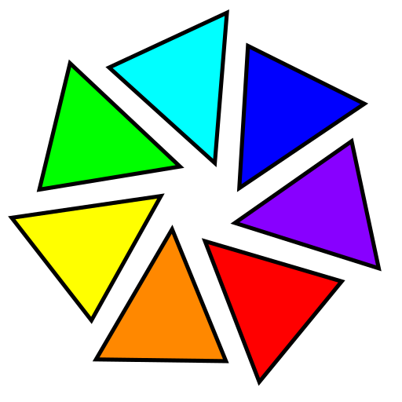

# Foteli

<p align="center"></p>

This project aims at exploring and providing high-quality, perceptually
plausible HDR tone mapping.

Provided are a C API for tone mapping Rec. 2020 + PQ to sRGB, as well as a
command-line tool that can be run on image files.

## C API usage

In a nutshell:

```c
FoteliParams* params = FoteliCreateParams();
FoteliSetFloatBuffers(params, &red, &green, &blue);
FoteliSetImageSize(params, width, height);

/* Optional, defaults to width: */
FoteliSetRowStride(params, row_stride);

if (const char* error_message = FoteliValidateParams(params)) {
  fprintf(stderr, "Foteli error: %s\n", error_message);
  exit(EXIT_FAILURE);
}
FoteliToneMap(params);
FoteliDestroyParams(params);
```

## Command-line tool usage

```shell
$ foteli pq_input.png srgb_output.png
```

## Future plans

In the future, we hope to improve this codebase in the following ways:

- support for other input and output colorspaces (at the very least, linear
  input, and wider output gamuts);

- exploring other tone mapping approaches.

We plan to maintain API and ABI stability while doing so.

## Contributing

See [`CONTRIBUTING.md`](CONTRIBUTING.md) for details.

## License

Apache 2.0; see [`LICENSE`](LICENSE) for details.

## Disclaimer

This project is not an official Google project. It is not supported by
Google and Google specifically disclaims all warranties as to its quality,
merchantability, or fitness for a particular purpose.
